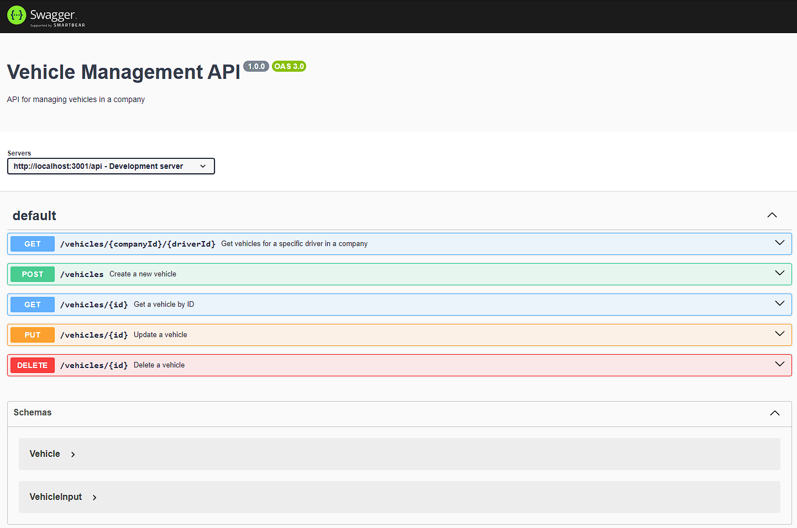

# Full-Stack Development Challenge

## Searching for a Backoffice Team Member

For this challenge, you have to create a small project from scratch to showcase your coding skills, project architecture knowledge, and attention to detail.

### 📌 Backend Requirements

Given a **MySQL** database with the tables `company`, `driver`, and `vehicle`, create endpoints for the following purposes:

1. **List vehicles by driver from a company**
2. **Create a new vehicle**

All **backend endpoints** should include:

- Tests (using the library of your choice)
- Validations
- Error handling

### 📌 Frontend Requirements

Using **React** and **React Router**, create a project with services to interact with the backend endpoints.

The final deliverable should include:

- A **table listing the vehicles**
- A **button to create a new vehicle**

By using **React Router**, the navigation should be properly structured:

- A user should be able to **list vehicles of a different driver** by changing the URL.
- Consider that a driver also **belongs to a company**.

### 🔧 Technical Requirements

- The backend must use **Node.js (v12+) and Express**.
- You have full control over the **software architecture** and **project structure**.  
  This is your opportunity to **shine** and show your **full potential** as a **full-stack developer**.

### 📂 Project Submission

- Create a **GitHub repository** for this project and share it with us.
- The project **must be finished and running** before the technical call.
- You should be prepared to:
  - **Explain** the decisions you made.
  - **Make a live change** during the interview.

### 🎯 Evaluation Criteria

We will assess your project based on:

- ✅ Naming conventions for routes (backend & frontend)
- ✅ Code readability
- ✅ Software design patterns
- ✅ Endpoint validations
- ✅ Error handling (backend & frontend)
- ✅ Tests for both backend endpoints and frontend components

We are eager to see your abilities and wish you **best of luck**!  
See you in the **live coding interview!** 🚀

### Swagger documentation

